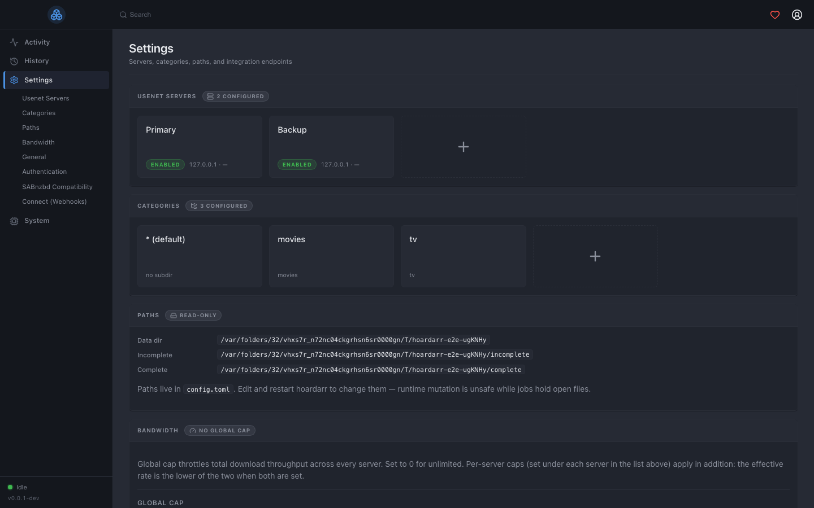
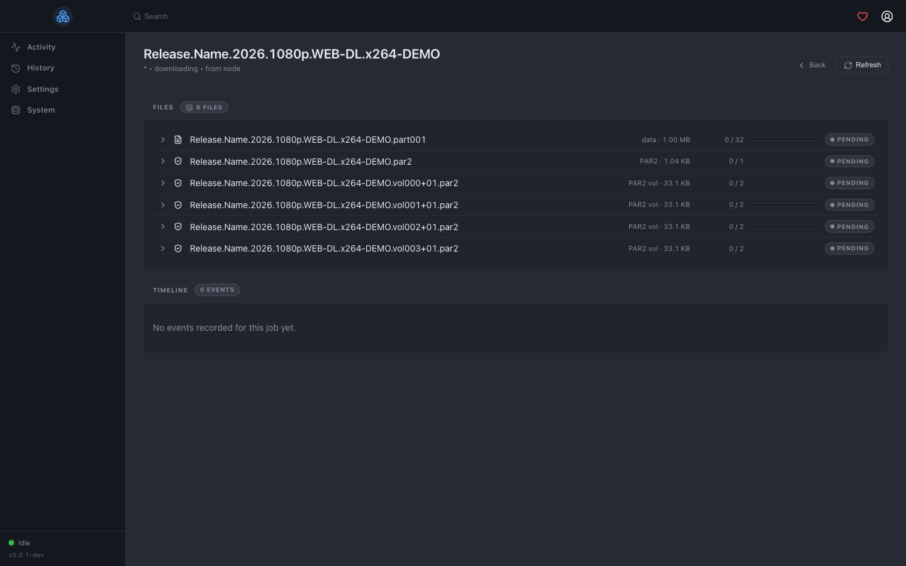
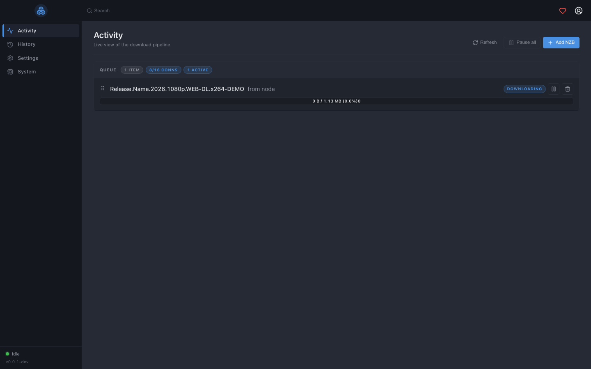
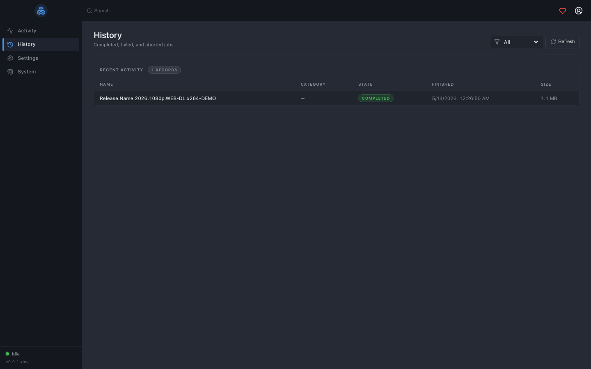
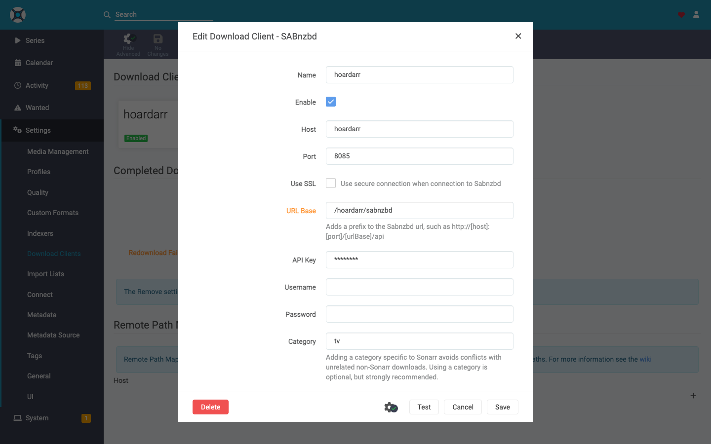

# hoardarr

[](https://github.com/jaenster/hoardarr/actions/workflows/ci.yml)
[](https://github.com/jaenster/hoardarr/actions/workflows/docker.yml)
[](https://github.com/jaenster/hoardarr/releases)
[](LICENSE)

**hoardarr** is a Go-based SABnzbd alternative with a Sonarr/Radarr-style UI.
Point Sonarr / Radarr / Lidarr / Readarr / Prowlarr at `/sabnzbd/api`
and they don't know the difference.






## Supported architectures

The image is built for both `linux/amd64` and `linux/arm64`. The
appropriate manifest is selected automatically by your Docker engine.

| Architecture | Tag |
|-|-|
| amd64 | `ghcr.io/jaenster/hoardarr:latest` |
| arm64 | `ghcr.io/jaenster/hoardarr:latest` |

Version tags: `:latest` tracks the most recent release. `:0.1.2`,
`:0.1`, `:0` follow semver for pinning.

## Usage

Copy this `docker-compose.yml`, adjust `PUID`/`PGID`/`TZ` + volumes
for your host, and `docker compose up -d`:

```yaml
services:
  hoardarr:
    image: ghcr.io/jaenster/hoardarr:latest
    container_name: hoardarr
    restart: unless-stopped
    environment:
      - PUID=1000
      - PGID=1000
      - TZ=Etc/UTC
    volumes:
      - ./data:/data
      - /srv/media/incomplete:/data/incomplete
      - /srv/media/complete:/data/complete
    ports:
      - "8085:8085"
```

Open `http://localhost:8085`, create the admin account, add a Usenet
server in `Settings → Servers`, then point Sonarr / Radarr at
`http://hoardarr:8085/sabnzbd` with the API key from
`Settings → Authentication`. See
[Coming from SABnzbd](#coming-from-sabnzbd) at the bottom for the
*arr-side download-client config (with screenshots).

### docker run

```bash
docker run -d \
  --name=hoardarr \
  -e PUID=1000 -e PGID=1000 -e TZ=Etc/UTC \
  -p 8085:8085 \
  -v $(pwd)/data:/data \
  -v /srv/media/incomplete:/data/incomplete \
  -v /srv/media/complete:/data/complete \
  --restart unless-stopped \
  ghcr.io/jaenster/hoardarr:latest
```

## Parameters

### Environment variables

| Variable | Default | Notes |
|-|-|-|
| `PUID` | `1000` | UID the binary drops to. Match your host user so bind-mount files end up owned by you. |
| `PGID` | `1000` | GID. Same idea. |
| `TZ` | `Etc/UTC` | IANA zone (e.g. `Europe/Amsterdam`). Used by slog timestamps + webhook payloads. |
| `HOARDARR_LISTEN` | `:8085` | Address the HTTP server binds to. |
| `HOARDARR_LOG_LEVEL` | `info` | `debug` / `info` / `warn` / `error`. |
| `HOARDARR_URL_BASE` | unset | Path prefix when behind a reverse proxy (e.g. `/hoardarr`). |

Runtime settings (bandwidth caps, max-concurrent jobs, sample-file
removal, recovery-vol deferral, etc.) live in `Settings → General` in
the UI and persist in the SQLite database. Only the bootstrap-time
knobs above are env-configurable.

### Volumes

| Path | Purpose |
|-|-|
| `/data` | Canonical state dir: `config.toml` (auto-generated), SQLite DB, sessions, logs. |
| `/data/incomplete` | In-flight job data. Survives container restarts. |
| `/data/complete` | Finished releases. Point your *arr stack to read from the same path. |

### Ports

| Port | Purpose |
|-|-|
| `8085/tcp` | Web UI + REST + SAB API (`/sabnzbd/api`) + Prometheus `/metrics`. |

## Updating

```bash
docker compose pull
docker compose up -d
```

The SQLite migrations are forward-only and run automatically on
startup. Downgrading after an upgrade is not supported; back up
`/data` before updating if you're nervous.

## Verifying the release

Every container image and binary tarball is signed with
sigstore-keyless via GitHub Actions provenance attestations (SLSA
build level 3). No PGP key to manage, no service to trust beyond
GitHub + the public Rekor transparency log.

```bash
# Container:
gh attestation verify oci://ghcr.io/jaenster/hoardarr:0.1.2 \
  --repo jaenster/hoardarr

# Source tarball:
gh attestation verify hoardarr_0.1.2_linux_amd64.tar.gz \
  --repo jaenster/hoardarr
```

A pass means the artifact was built by hoardarr's own GitHub Actions
workflow from the matching git tag.

## Reverse proxy

hoardarr speaks plain HTTP by design. For HTTPS, put nginx / Caddy /
Traefik in front. See [`docs/reverse-proxy.md`](docs/reverse-proxy.md)
for snippets covering hostname mounts (`hoardarr.example.com`) and
path-prefix mounts (`example.com/hoardarr`), plus the SSE-buffering
gotcha that breaks live progress under every proxy by default.

## Observability

`/metrics` is a Prometheus scrape endpoint behind the same API-key
auth as the rest of the API. See
[`docs/observability.md`](docs/observability.md) for scrape config,
the metric reference, and a starter alert ruleset.

## Backup

Stop hoardarr and copy `/data`. SQLite WAL is checkpointed
periodically and on shutdown, so the bytes on disk are consistent.

```bash
docker compose stop hoardarr
tar -czf hoardarr-backup-$(date +%F).tar.gz data/
docker compose start hoardarr
```

Finished releases in `complete/` are unaffected if you only restore
the `data/` subtree — in-progress jobs in `incomplete/` start over on
next boot.

## Coming from SABnzbd

In Sonarr / Radarr / Lidarr / Readarr / Prowlarr,
`Settings → Download Clients` → `+` → **SABnzbd**. Toggle
**`Show Advanced`** in the top toolbar *before* filling the form —
the one field most people miss is `URL Base`, and it only renders
after that toggle:



For a default install, set `URL Base = /sabnzbd`. If you put hoardarr
behind a reverse proxy at `/hoardarr`, it's `/hoardarr/sabnzbd`. An
empty URL Base makes the `Test` button fail with a misleading
"Sabnzbd authentication failed" — that's almost always this.

Full walk-through (per-app categories, common test-failure diagnostics,
running side-by-side with SABnzbd, etc.):
[**`docs/coming-from-sabnzbd.md`**](docs/coming-from-sabnzbd.md).

## Status

Pre-1.0. The SAB-API drop-in works in production against Sonarr /
Radarr / Lidarr / Readarr / Prowlarr. The Go-side API and DB schema
may still shift before 1.0; expect occasional breaking changes (and
backwards-compatible migrations) until then.

## Building from source

You generally don't need to; the Docker image is the recommended path.
Contributors / developers see [CONTRIBUTING.md](CONTRIBUTING.md) for
the dev loop and [docs/architecture.md](docs/architecture.md) for the
DDD + outbox + bounded-contexts layout.

## License

MIT — see [`LICENSE`](LICENSE).
