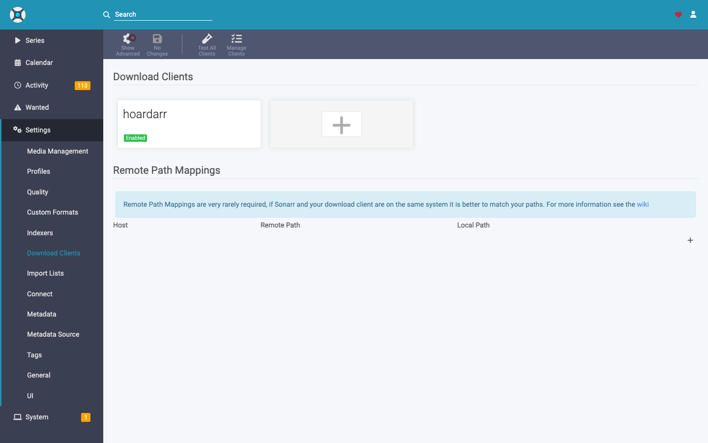

# Coming from SABnzbd

You're already running Sonarr / Radarr / Lidarr / Readarr / Prowlarr
pointed at a SABnzbd container, and you'd like to replace SAB with
hoardarr — or run hoardarr alongside SAB and have the *arr suite
treat hoardarr as a second download client. Either works. The *arr
clients talk to hoardarr over the exact same SAB API they already
speak.

You configure hoardarr in the *arr's `Settings → Download Clients`
the same way you'd configure SABnzbd. Only two things differ in
practice:

1. **The hostname + port** point at hoardarr, not your SAB container.
2. **The `URL Base` field**, hidden behind `Show Advanced`, has to
   match the path prefix hoardarr is mounted at. **This is the one
   footgun that catches everyone the first time.** Sonarr's SAB form
   defaults the URL Base to empty, and an empty URL Base makes the
   test fail with a misleading "Sabnzbd authentication failed" —
   because Sonarr ends up hitting `/api` on hoardarr's root mux
   instead of `/sabnzbd/api`.

The rest of this doc walks Sonarr through. Radarr / Lidarr / Readarr
/ Prowlarr's SAB form is identical (same upstream code).

## Sonarr

### 1. `Settings → Download Clients` → click the `+` Add tile

You'll see your existing download clients plus a `+` tile.

In Sonarr's "Add Download Client" modal that opens, pick **SABnzbd** —
*not* "NZBGet" or anything else. You're telling Sonarr to use the SAB
API; hoardarr is the server on the other end.

### 2. Click `Show Advanced` in the top toolbar, then fill the form

The `URL Base` field only renders after you toggle the `Show Advanced`
button in Sonarr's top toolbar. **Do that first** — then fill the
form. You want to end up with something that looks like this:

| Field | Value |
|-|-|
| Name | `hoardarr` (anything, just a label) |
| Enable | ✓ |
| Host | The hostname/IP where hoardarr is reachable from Sonarr's perspective. Same-host Docker compose: the service name (`hoardarr`). Same machine on the host network: `localhost`. Separate machine: that machine's IP/DNS. |
| Port | `8085` (or whatever you set `HOARDARR_LISTEN` to) |
| Use SSL | leave **unchecked** unless you put a TLS reverse proxy in front (Sonarr will validate the cert) |
| **URL Base** | See the table below — this is the field most people miss. |
| API Key | Copy from hoardarr's `Settings → Authentication` page |
| Username / Password | leave blank — hoardarr doesn't use SAB's web auth |
| Category | `tv` for Sonarr, `movies` for Radarr, etc. Pick a category you've created in hoardarr's `Settings → Categories` |

### What to put in `URL Base`

| Your hoardarr setup | URL Base value |
|-|-|
| Default (no reverse-proxy prefix) | `/sabnzbd` |
| Behind a reverse proxy at `/hoardarr` | `/hoardarr/sabnzbd` |
| Behind any other prefix `<X>` | `<X>/sabnzbd` |

The help text in Sonarr's own UI says it best: *"Adds a prefix to the
Sabnzbd url, such as `http://[host]:[port]/[urlBase]/api`"*. hoardarr's
SAB shim lives at `<host>:<port>/sabnzbd/api` by default; if you put
hoardarr behind a reverse proxy and set `HOARDARR_URL_BASE=/hoardarr`,
it moves to `<host>:<port>/hoardarr/sabnzbd/api` and your URL Base
has to match.

### 3. Test → Save

Click `Test` (bottom right). You should see a green ✓. If you get
red, the diagnostic is almost always one of three:

- **`Sabnzbd authentication failed`** — wrong API key, or wrong URL
  Base. Sonarr is reaching *some* hoardarr endpoint but not the SAB
  shim; the URL Base is the culprit nine times out of ten. Double-check
  it matches your `HOARDARR_URL_BASE` env var (or `Settings →
  General → URL base` in the hoardarr UI).
- **`Connection failed`** — Sonarr can't reach `<host>:<port>` at
  all. Network / DNS issue, or hoardarr isn't listening on that
  port. `docker logs hoardarr` to confirm it's up.
- **`Unable to communicate with Sabnzbd`** with no specifics —
  hoardarr returned a non-JSON response. Likely your reverse proxy
  is in front of `/sabnzbd/` but stripping the path before forwarding
  to hoardarr. Check the proxy config; hoardarr expects to see the
  `/sabnzbd/api` path as Sonarr sent it.

Save. Sonarr immediately starts using hoardarr for new grabs.

## Radarr / Lidarr / Readarr / Prowlarr

The SAB form is shared across the *arr suite — same fields, same URL
Base gotcha, same diagnostics. The only thing to change per app is
the **Category** so each app's downloads land in their own subdir
under `/data/complete`:

| App | Category |
|-|-|
| Sonarr | `tv` |
| Radarr | `movies` |
| Lidarr | `music` |
| Readarr | `books` |
| Prowlarr | (no download client config needed — Prowlarr feeds the others) |

## Running hoardarr *alongside* SABnzbd

You don't have to remove SABnzbd to try hoardarr. Add hoardarr as a
**second** download client with a different category — say
`tv-hoardarr` — and Sonarr routes grabs to whichever client matches
the category on the release. Once you're confident, flip the
categories over or delete the SAB entry.

## Migrating existing history / queue

There's no automated import from a SABnzbd instance yet. Anything
sitting in your SAB queue at switchover finishes on SAB; new grabs
after switchover come into hoardarr. Each tool's history is
independent — the *arr suite's own history is the source of truth
across the cut-over.
